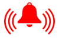

# Alarmas HTML con WaaS

Opciones disponibles:

* Actualizar el log con cualquier request [aquí](/log_any)

    - Ejemplo con get: [Hola mundo](/log_any/?hola_mundo)

* Ver log

Lista para probar que funciona el código:

* Ya cambiaremos esto por una lista generada por código